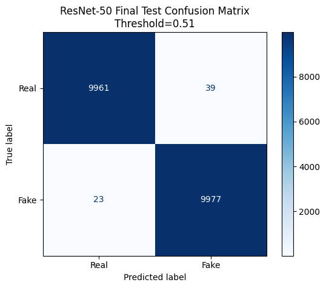
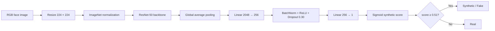
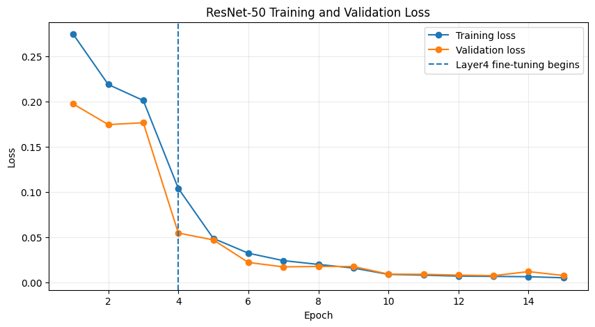
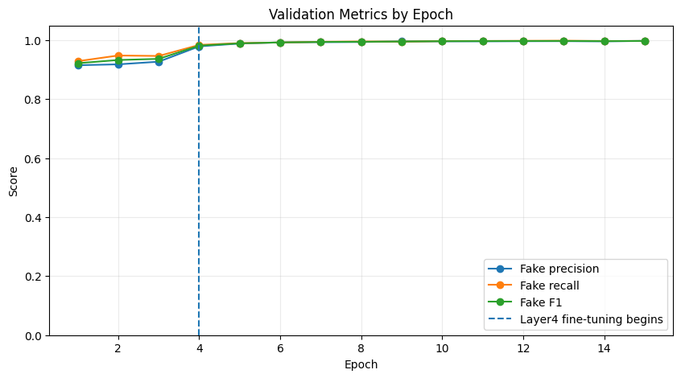
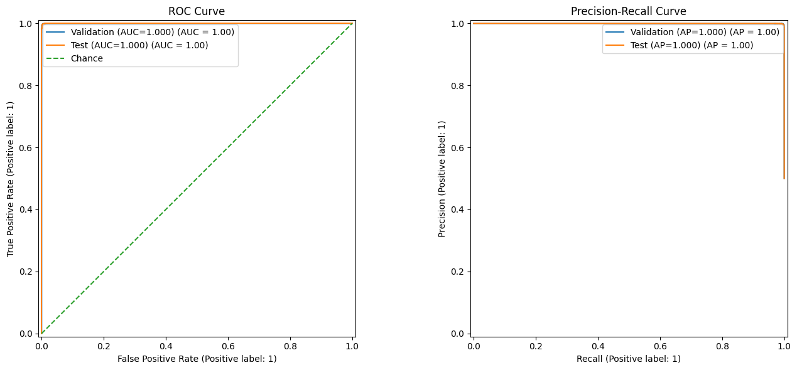

# Synthetic Sight

**Detecting AI-generated faces for digital literacy**  
AI4ALL Ignite · Summer 2026 · Team 9C  
Julissa Lema · Kristine Johnson · Ricky Dixon · Shloka Kandukuri

Synthetic Sight is a reproducible computer-vision research prototype that asks:

> **Can a CNN classifier distinguish real human faces from StyleGAN-generated synthetic faces well enough to help flag possible misinformation?**

The final system uses **ImageNet-pretrained ResNet-50 transfer learning** to classify still face images as **Real (0)** or **Synthetic/Fake (1)**. It is designed as a **review-support signal**, not an authentication service and not a universal deepfake detector.

## Final benchmark result

| Metric | Final result |
|---|---:|
| Locked test images | 20,000 (10,000 real / 10,000 synthetic) |
| Accuracy | **99.69%** |
| Fake F1 | **99.69%** |
| ROC-AUC | **99.995%** |
| Decision threshold | **0.51** |
| False positives | 39 real images flagged synthetic |
| False negatives | 23 synthetic images labeled real |

The test split was held out while the model, checkpoint, and threshold were developed. These results show extremely strong separation **within this benchmark**; they do not establish the same performance on newer generators, face swaps, video, screenshots, heavy recompression, or uncontrolled real-world images.



## What changed from the original project archive

This repository has been consolidated around the **final ResNet-50 pipeline** used for the presentation. Exploratory Random Forest, custom CNN, FFT, PCA, duplicate deployment experiments, the unfinished React frontend, and stale result artifacts were removed from the main code path. Their role in the project is documented in [`docs/project-history.md`](docs/project-history.md).

One integrity issue was important enough **not** to hide: the checkpoint bundled inside the original API/Streamlit folders was an **older epoch-9 model** with threshold `0.50`, dropout `0.40`, and no BatchNorm layer in the classifier head. The true final checkpoint was recovered from the project's `deepfake_detection_checkpoints` artifact archive produced by the executed notebook originally named `training_exploration_reinteration_kristine.ipynb`. The recovered model is epoch 13, uses the final BatchNorm + Dropout 0.30 head, and stores the selected threshold `0.51`. It is now included at `models/best_resnet50.pth` and verified before deployment.

## Method



### Final training configuration

- **Dataset:** Kaggle *140k Real and Fake Faces* — FFHQ real faces + StyleGAN synthetic faces.
- **Splits used:** 100,000 train, 20,000 validation, 20,000 locked test images.
- **Input:** RGB, `224 × 224`, ImageNet normalization.
- **Training augmentation only:** horizontal flip (`p=0.5`) and light color jitter.
- **Stage 1:** freeze the pretrained backbone and train the new classifier head for 3 epochs.
- **Stage 2:** unfreeze ResNet-50 `layer4` and fine-tune it with the head.
- **Loss:** `BCEWithLogitsLoss`.
- **Optimizer:** Adam, weight decay `1e-4`.
- **Learning rates:** head `5e-4`; `layer4` `1e-5` when fine-tuning starts.
- **Seed:** 13; batch size 32; maximum 15 epochs.
- **Threshold selection:** validation sweep from `0.05` to `0.95` in `0.01` increments, maximizing Fake F1.
- **Selected model:** epoch 13 at threshold `0.51`.

The final notebook's implementation monitors **validation Fake F1** for checkpointing. Epoch 13 also has the **lowest recorded validation loss**, which is why the final presentation's “lowest validation loss” description identifies the same checkpoint.




## Repository layout

```text
SyntheticSight_Final/
├── README.md
├── assets/                         # Final-run plots used by the documentation
├── deployment/
│   ├── streamlit_app.py            # Interactive research prototype
│   ├── api.py                      # Reusable FastAPI inference endpoint
│   └── Dockerfile
├── docs/
│   ├── architecture.md
│   ├── bias-and-ethics.md
│   ├── data.md
│   ├── deployment.md
│   ├── evaluation.md
│   ├── project-history.md
│   ├── references.md
│   └── repository-review.md
├── models/
│   ├── model_metadata.json
│   ├── training_history.csv
│   ├── validation_metrics.csv
│   ├── final_test_metrics.csv
│   └── README.md                   # Final-checkpoint instructions
├── notebooks/
│   ├── 01_resnet50_final_training.ipynb
│   └── 02_apparent_lightness_audit.ipynb
├── scripts/verify_checkpoint.py
├── src/synthetic_sight/            # Shared model + inference code
└── tests/                           # Model/preprocessing contract tests
```

## Setup

### 1. Create an environment

```bash
python -m venv .venv
source .venv/bin/activate          # Windows: .venv\Scripts\activate
python -m pip install --upgrade pip
pip install -e ".[app,api]"
```

For notebook work:

```bash
pip install -e ".[research,dev]"
```

### 2. Verify the included final checkpoint

The verified **epoch-13 final checkpoint** is included at:

```text
models/best_resnet50.pth
```

Verify its architecture and metadata contract before deployment:

```bash
python scripts/verify_checkpoint.py models/best_resnet50.pth
```

Expected SHA-256:

```text
d9a7fd6a692c942b550f9848500dc3ffb10d5809cb0d0091990648bf369ad21c
```

The validator checks the final architecture contract, epoch, label mapping, and threshold. A legacy artifact fails rather than silently producing mismatched predictions.

### 3. Run the Streamlit prototype

```bash
streamlit run deployment/streamlit_app.py
```

### 4. Run the FastAPI service

```bash
uvicorn deployment.api:app --reload
```

Interactive API documentation is available at `/docs` while the service is running.

## Evaluation

The official test set contains 10,000 real and 10,000 synthetic images and was evaluated only after development decisions were complete.

| Ground truth | Predicted Real | Predicted Synthetic |
|---|---:|---:|
| Real (10,000) | **9,961** TN | **39** FP |
| Synthetic (10,000) | **23** FN | **9,977** TP |



See [`docs/evaluation.md`](docs/evaluation.md) for metric definitions, threshold interpretation, and error analysis.

## Bias, representation, and responsible use

Balanced Real/Fake classes do **not** establish demographic fairness. The project therefore added a preliminary apparent-lightness audit using OpenCV face detection, forehead/cheek sampling, and CIE Lab `L*`. This is a measurable image characteristic—not race, ethnicity, gender, ancestry, or inherent skin color—and it is sensitive to lighting, exposure, editing, makeup, and face-detection errors.


The detector should **flag content for review**, not authenticate it. False positives can cast doubt on legitimate images; false negatives can create false reassurance. See [`docs/bias-and-ethics.md`](docs/bias-and-ethics.md).

## Reproducibility notes

- Training and validation file paths were checked for zero overlap.
- The test split stayed locked until checkpoint and threshold decisions were complete.
- The final training provenance traces to the executed source notebook `training_exploration_reinteration_kristine.ipynb`; the polished repository includes its consolidated counterpart as `notebooks/01_resnet50_final_training.ipynb`.
- The notebook records the sample configuration, labels, seed, transforms, training schedule, checkpoint metadata, and evaluation logic.
- The final repository deliberately rejects legacy checkpoints whose architecture metadata does not match the final run.
- A stronger future audit should also check image near-duplicates and source-level correlations.

## Next steps

1. Test the existing model on **unseen generator families before retraining** to measure generator drift.
2. Evaluate compression, resizing, screenshots, filters, and other real-world transformations.
3. Join apparent-lightness audit rows to prediction/error records and compare error rates with sample sizes and uncertainty.
4. Evaluate probability calibration rather than assuming model scores are literal real-world probabilities.
5. Extend beyond still images with video-specific, spatiotemporal benchmarks and architectures.

## Documentation

- [Architecture](docs/architecture.md)
- [Dataset and data protocol](docs/data.md)
- [Evaluation and metrics](docs/evaluation.md)
- [Bias and ethics](docs/bias-and-ethics.md)
- [Deployment](docs/deployment.md)
- [Project evolution](docs/project-history.md)
- [Repository review and consolidation decisions](docs/repository-review.md)
- [References](docs/references.md)

## References

Core references include He et al. (2016) for ResNet, Deng et al. (2009) for ImageNet, Karras et al. (2019) for StyleGAN, Mo (2020) for the benchmark dataset, and Nightingale & Farid (2022) for the human-perception motivation. Full citations are in [`docs/references.md`](docs/references.md).

---

**Use statement:** Synthetic Sight is an educational research prototype. Its output is a model score under a specific benchmark distribution; it should not be treated as legal proof, identity verification, provenance certification, or an automated high-impact decision.
