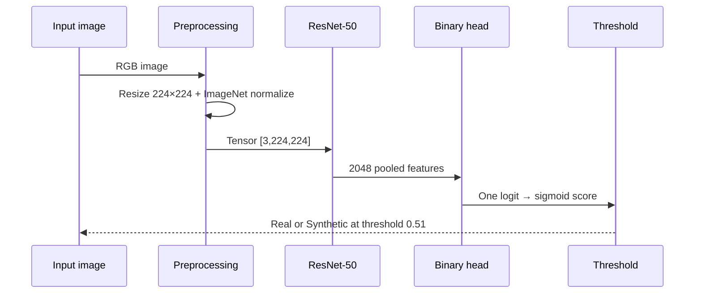

# Architecture

## Final model

Synthetic Sight uses **ResNet-50 transfer learning** for binary supervised image classification. The pretrained network supplies general visual features; the project adapts the final representation to distinguish **Real (0)** from **Fake/Synthetic (1)** face images.

### Classifier head

```text
ResNet-50 pooled features (2048)
        ↓
Linear(2048 → 256)
        ↓
BatchNorm1d(256)
        ↓
ReLU
        ↓
Dropout(p=0.30)
        ↓
Linear(256 → 1)
        ↓
Sigmoid at inference
```

The backbone itself contains standard 2-D spatial convolutions, including `1×1` pointwise and `3×3` spatial convolutions in bottleneck blocks, BatchNorm, ReLU, early max pooling, residual connections, and global/adaptive average pooling. It is **not** an Inception, Xception, DenseNet, or depthwise-separable architecture.

## Two-stage transfer learning

1. **Head-only stage (epochs 1–3):** all pretrained backbone parameters are frozen; only the new binary head is optimized.
2. **Layer4 fine-tuning (epoch 4 onward):** the final ResNet stage, `layer4`, is unfrozen while earlier stages remain frozen. The classifier head continues training.

The implementation keeps frozen-backbone BatchNorm statistics from drifting. During `layer4` fine-tuning, the layer's `BatchNorm2d` modules remain in evaluation mode while its trainable convolutional parameters update.

## Optimization

| Setting | Final value |
|---|---:|
| Loss | `BCEWithLogitsLoss` |
| Optimizer | Adam |
| Head learning rate | `5e-4` |
| Layer4 learning rate | `1e-5` |
| Weight decay | `1e-4` |
| Batch size | 32 |
| Seed | 13 |
| Maximum epochs | 15 |
| Head-only epochs | 3 |
| Early-stopping patience | 3 fine-tuning epochs |

A `ReduceLROnPlateau` scheduler monitors validation loss within each training stage.

## Input-to-output path



## Why shared inference code matters

The original repository had separate inference implementations with different architectures and thresholds. The final repository centralizes the model builder, checkpoint validation, preprocessing, and threshold logic in `src/synthetic_sight/`. Streamlit and FastAPI now call the **same** inference code path.
