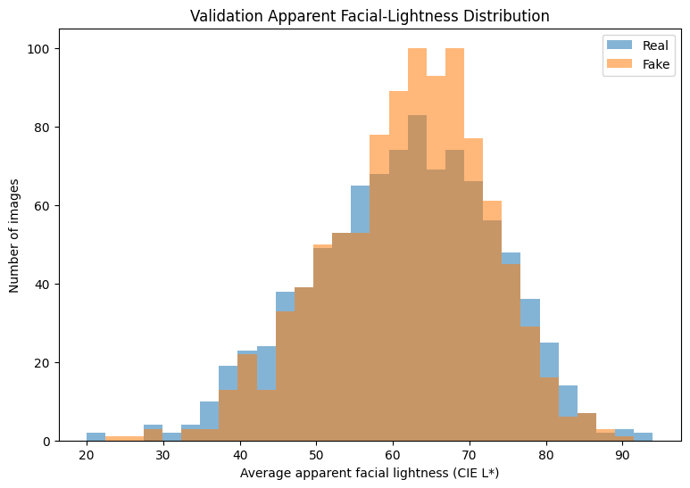
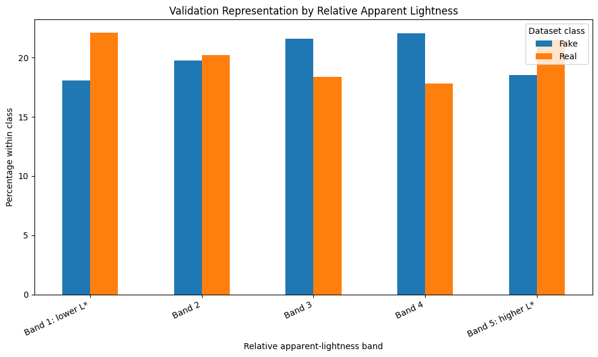

# Bias, Representation, and Responsible Use

## Core principle

Synthetic Sight can reduce some inconsistency in human visual judgment, but it can also encode dataset gaps, learn source shortcuts, and encourage user overconfidence. Responsible use requires keeping those limits visible.

## How bias can enter the system

- **Representation gaps:** error rates may vary across underrepresented people or image conditions even when aggregate accuracy is high.
- **Generator drift:** a StyleGAN detector may not transfer to diffusion models, face swaps, video, or future generators.
- **Shortcut learning:** the network may exploit cropping, resolution, compression, lighting, or background cues associated with benchmark sources.
- **Evaluation bias:** repeated use of a test set can turn it into another development set and inflate reported performance.
- **Interface overtrust:** a polished probability display can make a model score look more certain than it is.

## Preliminary apparent-lightness audit

The project intentionally did **not** infer race, ethnicity, ancestry, gender, or biological skin color from faces. Instead, the audit measured a narrower, observable image characteristic:

1. Detect a face with OpenCV.
2. Select the largest face in the centered portrait benchmark.
3. Sample conservative forehead and cheek regions.
4. Convert sampled color values to CIE Lab.
5. Use `L*` as a measure of **apparent image lightness**.

`L*` is still affected by lighting, exposure, white balance, makeup, editing, cropping, and detector errors. The audit is therefore a **representation check**, not a demographic label and not a fairness certification.

### Face-detection success in the audit

| Split / class | Detected |
|---|---:|
| Training synthetic | 99.32% (4,966 / 5,000) |
| Training real | 94.24% (4,712 / 5,000) |
| Validation synthetic | 99.20% (992 / 1,000) |
| Validation real | 95.90% (959 / 1,000) |

The detector itself therefore changes which images receive an `L*` measurement and can introduce selection bias into the audit.

### Relative lightness bands

The measured real and synthetic samples had broadly comparable average apparent lightness, while their distributions across relative bands differed. Comparable means do not prove equivalent representation or equivalent error rates.

## Mitigations used in this project

- Consistent image size, color mode, and normalization.
- Balanced Real/Fake labels.
- Separate validation and locked test data.
- Threshold selection on validation data only.
- Explicit reporting of false positives and false negatives.
- Preliminary representation audit with limitations documented.
- Deployment language that describes results as review signals, not proof.

## Recommended next audit

Join every audit measurement to the corresponding prediction and error record. Then compare false-positive and false-negative rates across sufficiently populated apparent-lightness bands, reporting sample sizes and uncertainty. This would answer a model-performance question that the current representation plots alone cannot answer.

## Prohibited interpretation

Do not say that:

- the system detects **all** deepfakes;
- a Real result proves authenticity;
- balanced classes prove demographic fairness;
- `L*` measurements identify race or ethnicity;
- the app learns from uploaded images—it performs fixed-model inference only.
