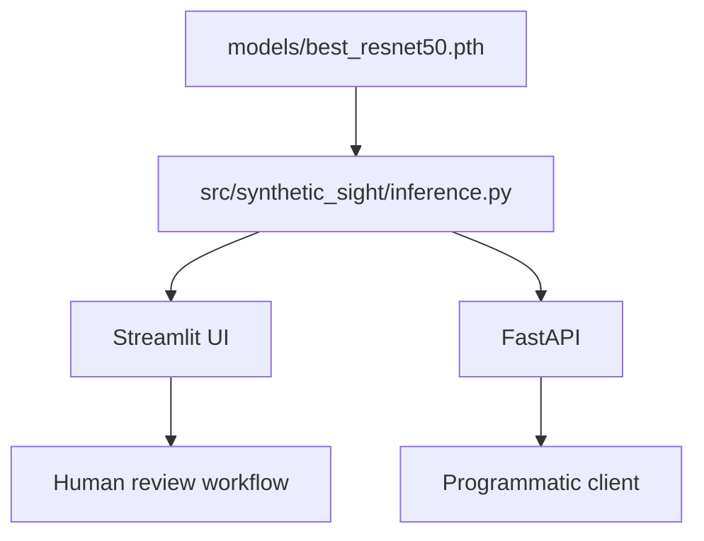

# Deployment

## Deployment Architecture

The final repository exposes one shared PyTorch inference implementation through two interfaces:



Both interfaces use the same model architecture, preprocessing rules, label mapping, and decision threshold. Note: this replaces the divergent Streamlit, ONNX, API, and frontend experiments used during earlier development. See [Project History](project-history.md).

---

## Required Model Artifact

Deployment uses the verified final checkpoint:

```text
models/best_resnet50.pth
```

The checkpoint is tracked with **Git LFS**. After cloning the repository normally, ensure the LFS object is available before attempting deployment:

```bash
git lfs install
git lfs pull
```

Then verify the checkpoint:

```bash
python scripts/verify_checkpoint.py models/best_resnet50.pth
```

The verification step checks the final artifact contract, including checkpoint identity and metadata such as epoch, threshold, label convention, input size, and classifier-head configuration. This prevents an older or incompatible checkpoint from being loaded as the final model.

---

## Streamlit Application

Install the application dependencies and start the interface:

```bash
pip install -e ".[app]"
streamlit run deployment/streamlit_app.py
```

The Streamlit interface presents:

- The predicted class
- Real and Synthetic model scores
- The validation-selected decision threshold
- Caution language describing the model's intended scope

The interface is designed as a **screening aid**, not an authenticity-verification service. Responsible-use and privacy considerations are documented in [Bias, Representation, and Responsible Use](bias-and-ethics.md).

---

## FastAPI Service

Install the API dependencies and start the development server:

```bash
pip install -e ".[api]"
uvicorn deployment.api:app --reload
```

### Endpoints

| Method | Endpoint | Purpose |
|---|---|---|
| `GET` | `/health` | Reports service status and whether a model file is available |
| `GET` | `/model` | Returns loaded model metadata |
| `POST` | `/predict` | Accepts an image and returns a classification result |

The API accepts JPEG, PNG, and WebP images up to **10 MB** by default.

---

## Configuration

Deployment behavior can be adjusted through environment variables:

| Variable | Purpose |
|---|---|
| `SYNTHETIC_SIGHT_MODEL_PATH` | Use an alternate checkpoint path |
| `SYNTHETIC_SIGHT_MAX_UPLOAD_BYTES` | Change the maximum accepted upload size |
| `SYNTHETIC_SIGHT_ALLOWED_ORIGINS` | Configure comma-separated CORS origins |

CORS is disabled unless allowed origins are explicitly configured.

---

## Deployment Contract

For Streamlit and FastAPI to produce consistent results, both must use the same:

1. Verified final checkpoint
2. `Real = 0`, `Synthetic/Fake = 1` label mapping
3. RGB `224 × 224` preprocessing
4. ImageNet normalization
5. Classifier architecture
6. Decision threshold of `0.51`

These shared requirements are implemented through `src/synthetic_sight/` rather than duplicated independently in each interface.

For model details, see [Architecture](architecture.md). For final performance, see [Evaluation](evaluation.md).
