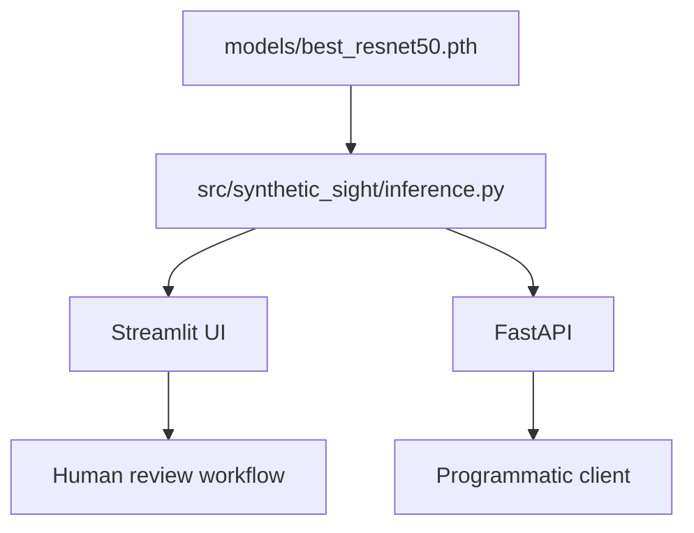

# Deployment

The final repository supports two interfaces over one shared PyTorch inference implementation:



This replaces the original repository's divergent Streamlit, ONNX, API, and frontend experiments.

## Required model artifact

Deployment uses the included verified final checkpoint at:

```text
models/best_resnet50.pth
```

Before deploying:

```bash
python scripts/verify_checkpoint.py models/best_resnet50.pth
```

The validator is deliberately strict. It checks the final epoch, threshold, label convention, image size, and classifier-head metadata so an older model cannot be mistaken for the final model.

## Streamlit

```bash
pip install -e ".[app]"
streamlit run deployment/streamlit_app.py
```

The UI displays:

- prediction label;
- synthetic and real model scores;
- the validation-selected decision threshold;
- explicit caution language about provenance and scope.

## FastAPI

```bash
pip install -e ".[api]"
uvicorn deployment.api:app --reload
```

Endpoints:

- `GET /health` — service status and whether a model file is present;
- `GET /model` — loaded model metadata;
- `POST /predict` — image classification.

The API accepts JPEG, PNG, and WebP files up to 10 MB by default. The limit can be changed with `SYNTHETIC_SIGHT_MAX_UPLOAD_BYTES`.

## Configuration

- `SYNTHETIC_SIGHT_MODEL_PATH` — alternate checkpoint path.
- `SYNTHETIC_SIGHT_MAX_UPLOAD_BYTES` — maximum upload size.
- `SYNTHETIC_SIGHT_ALLOWED_ORIGINS` — comma-separated CORS origins; CORS is disabled unless explicitly configured.


